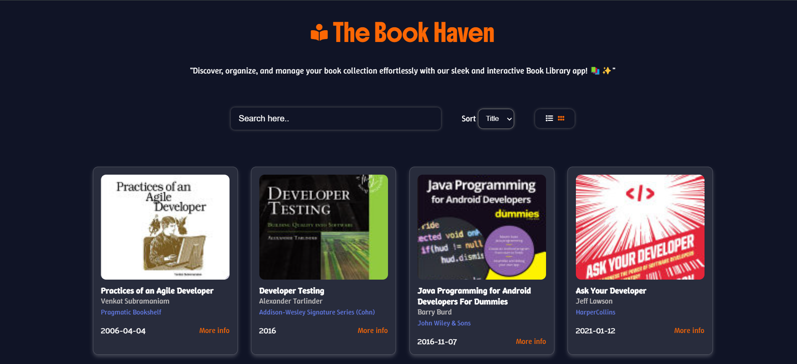
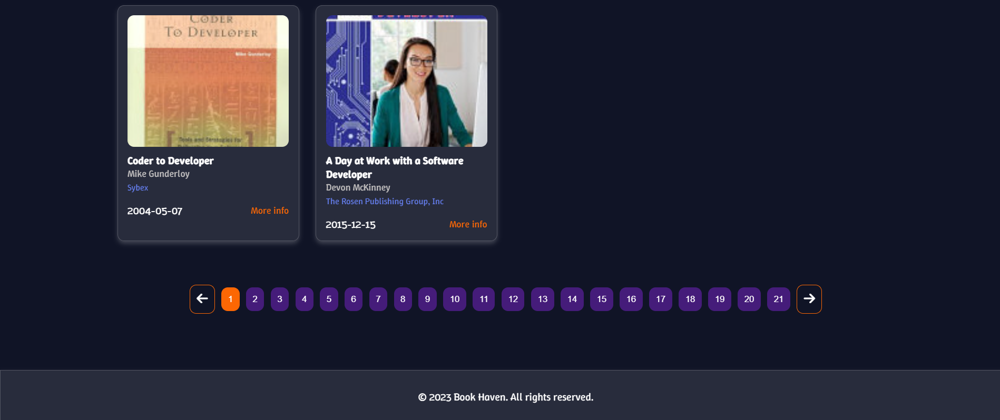
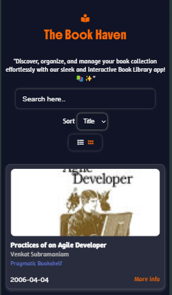

# 📖 THE BOOK HAVEN

Book Haven Library is a sanctuary for book lovers, offering a vast collection of literature across genres, from timeless classics to contemporary bestsellers. 

## TECH STACK USED

- HTML 
- CSS
- JS

## FEATURES 🚀

- A list of all famous books to read.
- Search functionality
- Sorting functionality based on title and year.
- Two different view modes (Grid and List).
- Pagination
- Responsive UI
- Direct links to book's information.

## FEATURES TO BE IMPLEMENTED ⌚

- Purchase links
- Add to Cart functionality
- Favourites 
- Category section

---

## HOW THIS WORKS ?

As already mentioned above, this project is built using HTML, CSS and Vanilla Javascript. In order to get the data, I have used the API which is given down below⬇️

[API LINK](https://api.freeapi.app/api/v1/public/books)

**Step1** -  Fetch the data from the API using the **fetch()** method available in JS. **Code available from line [142-166]**

**Step2** - Display the data in the UI, by creating book cards.

**Step3** - Implement a search functionality which filters out the data based on the user search input. **Code available from line [50-66]**

**Step4** - Implement the sorting functionality which sorts the book list according to title and published date of the book. **Code available from line [24-47]**

**Step4** - Implement the view functionality which helps to view the books list in list view or grid view  **Code available from line [11-21]**

**Step5** - Implement the pagination functionality which helps the user to navigate to different pages to view more contents **Code available from line [93-137]**

---

## SCREENSHOTS

### Heading part

### Controls

### Book Card

### Pagination

### Footer

### Overall website in Desktop view

### Mobile view

# 😀

